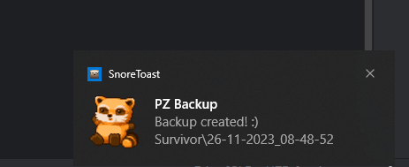

# PZ Backup

A backup tool to make a copy or restore your latest save. PZ can be harsh, so let's have at least ONE backup to revert to :)

*Features*
- Saves only the latest save game
- Restores only one backup and only for the latest save game



*Caveats*
- Tested on Windows only 
- Tested using default installation directory only under %UserProfile%

## Support & contributing

If you run into any problems, feel free to [open an issue](https://github.com/orestes/pz-backup/issues).

If you want to contribute, [Pull Requests](https://github.com/orestes/pz-backup/pulls) are always welcome.

## Usage

```npm run backup```

```npm run restore```

## On StreamDeck

Using these commands on StreamDeck greatly improves the usage experience.
Some great icons to use are can be found [in the PZ Wiki](https://pzwiki.net/wiki/Spiffo)

## License

[Spiffo](https://pzwiki.net/wiki/Spiffo)'s icon redistributed in this package is owned by [The Indie Stone](https://projectzomboid.com)

PZ Backup is Free and Open Source Software